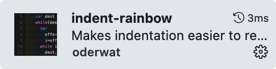
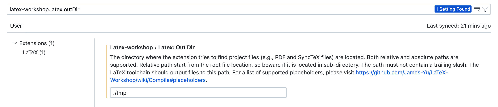
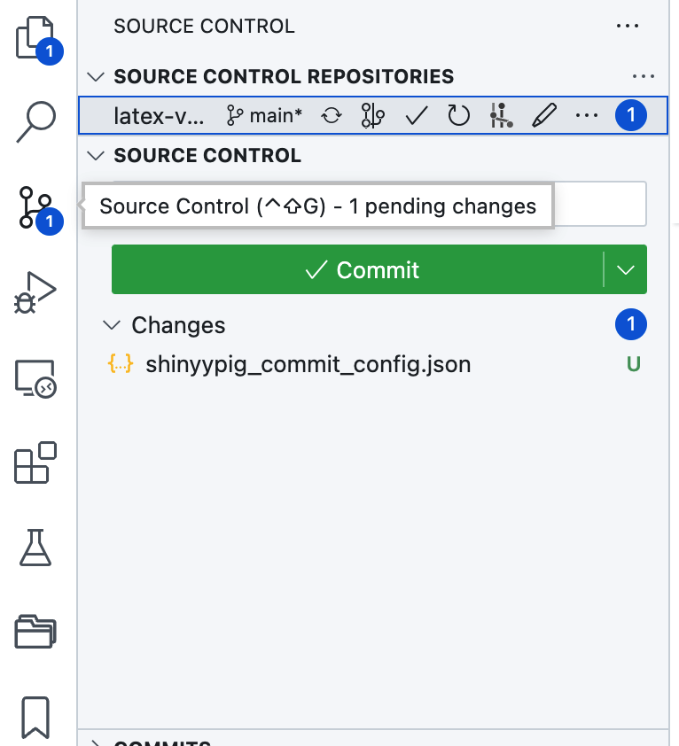
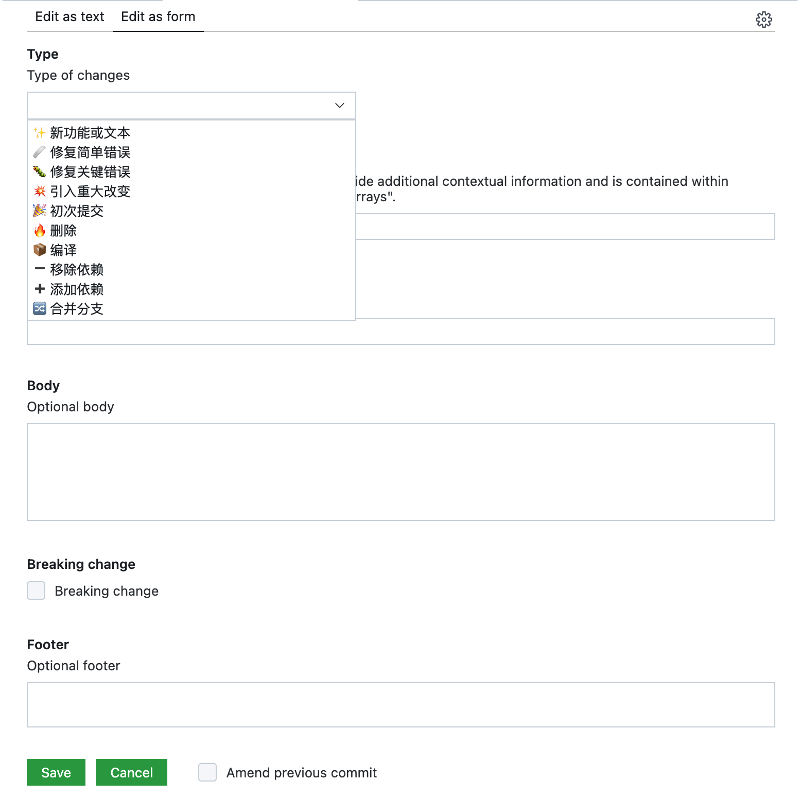

# 在 VSCode 中配置 LaTeX 环境

本教程将介绍如何在 VSCode 中配置 LaTeX 环境，以便于在 VSCode 中进行 LaTeX 的编写和预览，打造一个舒适便捷的 LaTeX 编写环境。

支持的功能有：

-   保存文件时自动编译
-   支持 XeLaTeX 和 PdfLaTeX 编译 (中英文)
-   编译结果输出到特定文件夹./tmp
-   英文单词补全，以及中文翻译
-   LaTeX 语法自动补全
-   支持快速输入公式，比如输入`@a`会自动补全为`\alpha`
-   自动补全路径
-   自动生成矩阵和图片环境
-   实时预览公式、图片
-   自动格式化 tex 文件

完整配置后的效果如下：


配置部分主要包含以下内容：

-   [软件安装](#软件安装)
    -   [TeX Live 安装](#tex-live-安装)
    -   [VSCode 安装](#vscode-安装)
-   [VSCode 插件](#vscode-插件)
    -   [如何安装](#如何安装)
    -   [插件推荐](#插件推荐)
-   [LaTeX Workshop 配置](#latex-workshop-配置)
    -   [基本配置](#基本配置)
    -   [编译工具链配置](#编译工具链配置)
-   [进阶配置](#进阶配置)
    -   [使用 latexindent 格式化 LaTeX 代码](#使用-latexindent-格式化-latex-代码)
    -   [使用 HyperSnips for Math 插件快速输入公式](#使用-hypersnips-for-math-插件快速输入公式)
    -   [使用 Git 进行版本管理](#使用-git-进行版本管理)
    -   [TiKZ Externalize 加速编译](#tikz-externalize-加速编译)

## 软件安装

### TeX Live 安装

TeX Live 是一个 LaTeX 发行版，并且包含较为完整的 LaTeX 环境，推荐使用 TeX Live 进行 LaTeX 的编译。如果之前安装过 MikTeX，一定要将其完全卸载后，再安装 TeX Live。

Windows / Linux 用户可以直接下载安装包进行安装，安装包下载地址为：[texlive.iso](https://mirrors.tuna.tsinghua.edu.cn/CTAN/systems/texlive/Images/)，下载 texlive.iso 文件，双击安装即可。

Mac 用户下载 Mac 版本的发行包，安装包下载地址为：[MacTeX.pkg](https://mirrors.tuna.tsinghua.edu.cn/ctan/systems/mac/mactex/)，下载 MacTeX.pkg 文件，双击安装即可。

### VSCode 安装

VSCode 是一个轻量级的编辑器，支持多种语言的编写，包括 LaTeX。安装包下载地址为：[Visual Studio Code](https://code.visualstudio.com/download)，下载对应系统的安装包，双击安装即可。

## VSCode 插件

### 如何安装

点击左侧的扩展按钮


搜索对应的插件，点击安装即可。

### 插件推荐

除了 LaTeX Workshop 之外，其他插件都是可选的，可以根据自己的需求进行安装。

-   LaTeX Workshop

    LaTeX Workshop 支持 LaTeX 的编译、预览、语法检查等功能。

    

-   English Word Hint

    English Word Hint 是一个英语单词提示插件，可以在编写英语文档时，自动提示相关英语单词，并显示对应的中文翻译，提高英文文档编写效率。

    

-   Path Auto Complete

    Path Auto Complete 可以自动补全路径，方便快速插入图片。

    

-   indent rainbow

    indent rainbow 可以为不同层级的缩进添加不同的颜色，方便阅读。

    

-   Word Count CJK

    Word Count CJK 可以统计中文文档的字数。

    

-   Code Spell Checker

    Code Spell Checker 可以检查文档中的英文单词拼写错误，轻量级插件，速度快，内存占用少。

    

-   LTex

    LTex 是一个拼写以及语法检查插件，不仅仅可以检查拼写错误，还可以检查语法错误，功能强大，但是速度较慢，内存占用较大。与 Code Spell Checker 两者可以视配置二选一。

    

-   Project Manager

    Project Manager 可以管理多个 VSCode 项目，方便快速打开或切换项目。

    

-   Material Icon Theme

    Material Icon Theme 可以为 VSCode 左侧的文件树添加图标，方便查看。

    

-   WakaTime

    WakaTime 可以统计编程时间，以及编程语言的使用时间，以帮助我们更好的规划学习时间。

    

## LaTeX Workshop 配置

下面的配置是我个人的配置，可以根据自己的需求进行修改。

### 基本配置

```json
"latex-workshop.hover.preview.mathjax.extensions": [
    "boldsymbol"
],
"latex-workshop.intellisense.package.enabled": true,
"latex-workshop.latex.outDir": "./tmp",
"latex-workshop.latex.recipe.default": "lastUsed",
"latex-workshop.mathpreviewpanel.cursor.enabled": true,
"latex-workshop.message.error.show": false,
"latex-workshop.message.warning.show": false,
"latex-workshop.view.pdf.invert": 1,
"latex-workshop.view.pdf.invertMode.enabled": "auto",
```

点击 VSCode 左下角的齿轮按钮，选择 settings （设置），进入设置界面。
搜索对应的条目，并修改为相应的配置，其余配置默认即可。比如：



如果比较熟悉 VSCode，可以点击左下角的齿轮按钮，选择 Command Palette (命令面板)，在命令面板中搜索 settings，打开 settings.json 文件，直接复制粘贴上面的代码，从而快速修改配置。

配置项的具体解释如下：

```text
// 鼠标悬停，预览公式时，支持 boldsymbol 宏
"latex-workshop.hover.preview.mathjax.extensions": [
    "boldsymbol"
],
// 是否启用 IntelliSense，自动补全引用的包中的环境和命令
"latex-workshop.intellisense.package.enabled": true,
// 编译后的文件输出目录
"latex-workshop.latex.outDir": "./tmp",
// 默认编译引擎为上次使用的
"latex-workshop.latex.recipe.default": "lastUsed",
// 预览复杂公式，使用时需要通过 command palette (命令面板) 打开
"latex-workshop.mathpreviewpanel.cursor.enabled": true,
// 不允许弹窗显示错误信息
"latex-workshop.message.error.show": false,
// 不允许弹窗显示警告信息
"latex-workshop.message.warning.show": false,
// 预览 PDF 时，反转颜色
"latex-workshop.view.pdf.invert": 1,
// 预览 PDF 时，自动检测是否需要反转颜色
"latex-workshop.view.pdf.invertMode.enabled": "auto",
```

### 编译工具链配置

推荐使用 latexmk 进行编译，latexmk 可以自动检测文档中的变化，自动进行编译，并且同时支持多种编译引擎，包括 XeLaTeX、PdfLaTeX。

在 settings.json 文件中找到 latex-workshop.latex.tools 和 latex-workshop.latex.recipes 配置项，将其全部删除，并修改为如下配置：

```json
"latex-workshop.latex.recipes": [
    {
        "name": "XeLaTeX",
        "tools": [
            "xelatexmk"
        ]
    },
    {
        "name": "PdfLaTeX",
        "tools": [
            "pdflatexmk"
        ]
    }
],
"latex-workshop.latex.tools": [
    {
        "args": [
            "-synctex=1",
            "-pdfxe",
            "-interaction=nonstopmode",
            "-file-line-error",
            "-outdir=%OUTDIR%",
            "%DOC%"
        ],
        "command": "latexmk",
        "env": {},
        "name": "xelatexmk"
    },
    {
        "args": [
            "-synctex=1",
            "-pdf",
            "-interaction=nonstopmode",
            "-file-line-error",
            "-outdir=%OUTDIR%",
            "%DOC%"
        ],
        "command": "latexmk",
        "env": {},
        "name": "pdflatexmk"
    }
],
```

## 进阶配置

这一部分的配置可选，如果不需要可以跳过。

### 使用 latexindent 格式化 LaTeX 代码

首先需要安装 latexindent.pl，具体安装方法可以参考 [latexindent.pl](https://github.com/cmhughes/latexindent.pl)。

修改 settings.json 文件，添加如下配置：

```json
"latex-workshop.latexindent.args": [
    "-g",
    "./%OUTDIR%/indent.log",
    "%TMPFILE%",
    "-y=defaultIndent: '%INDENT%'"
],
```

该配置的主要目的是将 latexindent.pl 的输出信息输出到 tmp/indent.log 文件中，方便统一管理。

### 使用 HyperSnips for Math 插件快速输入公式

首先安装 HyperSnips for Math， 然后根据插件说明进行基本配置。

利用该插件可以快速输入公式，比如输入 `eq` 就可以自动生成

```latex
\begin{equation}

\end{equation}
```

[latex.hsnips](latex.hsnips)是我的个人配置，主要支持两个功能

输入 `bmat n m` 然后按空格键，可以自动生成对应大小的空矩阵：

```latex
// bmat 3 4
\begin{bmatrix}
     &  &  &  \\
     &  &  &  \\
     &  &  &  \\
\end{bmatrix}
```

输入 `fig label n` 然后按空格键，可以自动生成对应数量的图片插入代码，label 则为对应的标签：

```latex
\begin{figure}[htb!]
    \centering
    \begin{subfigure}{.3\textwidth}
        \centering
        \includegraphics[width=\textwidth]{./img}
        \caption{}
        \label{fig:example_1}
    \end{subfigure}
    \begin{subfigure}{.3\textwidth}
        \centering
        \includegraphics[width=\textwidth]{./img}
        \caption{}
        \label{fig:example_2}
    \end{subfigure}
    \begin{subfigure}{.3\textwidth}
        \centering
        \includegraphics[width=\textwidth]{./img}
        \caption{}
        \label{fig:example_3}
    \end{subfigure}
    \caption{}
    \label{fig:example}
\end{figure}
```

其余配置可以根据自己的需求进行修改。

### 使用 Git 进行版本管理

首先需要安装 Git：点击 VSCode 左侧的 Source Control (源代码管理) 图标，如果没有安装 Git，会提示安装，根据提示安装即可。



推荐安装的插件有：

-   GitLens

    GitLens 拓展了 VSCode 的源代码管理功能，可以查看每一行代码的提交记录，以及每一次提交的详细信息。但是需要 pro 会员才能解锁全部功能，建议直接在设置中关闭 pro 功能。相关功能，安装下方开源免费插件替代即可。

-   Git Graph

    Git Graph 可以以图形化的方式展示 Git 仓库的提交记录，方便查看。

-   Commit Message Editor

    Commit Message Editor 可以格式化 commit 信息。可以导入该[配置](shinyypig_commit_config.json)，方便统一管理，效果如下。



### TiKZ Externalize 加速编译

确保你的 LaTeX 的输出目录为`./tmp/`，然后在你的 tex 文件中添加如下代码：

```latex
\usetikzlibrary{external}
\immediate\write18{mkdir -p tmp/tmp/}
\tikzexternalize[
    prefix=tmp/,
    mode=list and make,
]
```

接着在文档根目录下新建`latexmkrc`文件，添加如下代码：

```perl
$clean_ext .= ' %R.figlist %R-figure* %R.makefile fls.tmp';
$latex    = 'internal tikzlatex latex    %B %O %S';
$pdflatex = 'internal tikzlatex pdflatex %B %O %S';
$lualatex = 'internal tikzlatex lualatex %B %O %S';
$xelatex  = 'internal tikzlatex xelatex  %B %O %S';
$hash_calc_ignore_pattern{'pdf'} = '^(/CreationDate|/ModDate|/ID)';
$hash_calc_ignore_pattern{'ps'} = '^%%CreationDate';

sub tikzlatex {
  my ($engine, $base, @args) = @_;
  my $ret = 0;
  print "Tikzlatex: ===Running '$engine @args'...\n";
  $ret = system( $engine, @args );
  print "Tikzlatex: Fixing .fls file ...\n";
  system "echo INPUT \"$aux_dir1$base.figlist\"  >  \"$aux_dir1$base.fls.tmp\"";
  system "echo INPUT \"$aux_dir1$base.makefile\" >> \"$aux_dir1$base.fls.tmp\"";
  system "cat \"$aux_dir1$base.fls\"    >> \"$aux_dir1$base.fls.tmp\"";
  rename "$aux_dir1$base.fls.tmp", "$aux_dir1$base.fls";
  if ($ret) { return $ret; }
  if ( -e "$aux_dir1$base.makefile" ) {
    if ($engine eq 'xelatex') {
      print "Tikzlatex: ---Correcting '$aux_dir1$base.makefile' made under xelatex\n";
      system( 'perl', '-i', '-p', '-e', 's/^\^\^I/\t/', "$aux_dir1$base.makefile" );
    }
    elsif ($engine eq 'latex') {
      print "Tikzlatex: ---Correcting '$aux_dir1$base.makefile' made under latex\n";
      system( 'perl', '-i', '-p', '-e', 's/\.epsi/\.ps/', "$aux_dir1$base.makefile" );
    }
    print "Tikzlatex: ---Running 'make -f $aux_dir1$base.makefile' ...\n";
    if ($aux_dir) {
    #   system "perl -i -p -e 's#-shell-escape#-shell-escape -output-directory=\"$aux_dir1\"#g' $aux_dir1$base.makefile";
      system "perl -i -p -e 's#$base.figlist#$aux_dir1$base.figlist#g' $aux_dir1$base.makefile";
      system "cp $aux_dir1$aux_dir1*.md5 $aux_dir1";
      system "rm -rf $aux_dir1$aux_dir1";
      $ret = system "make",  "-j", "10", "-f", "$aux_dir1$base.makefile";
      system "rm $base.run.xml";
    }
    else {
      $ret = system "make",  "-j", "10", "-f", "$base.makefile";
    }
    if ($ret) {
      print "Tikzlatex: !!!!!!!!!!!!!! Error from make !!!!!!!!! \n",
            "  The log files for making the figures '$aux_dir1$base-figure*.log'\n",
            "  may have information\n";
    }
  }
  else {
    print "Tikzlatex: No '$aux_dir1$base.makefile', so I won't run make.\n";
  }
  return $ret;
}
```

最后，LaTeX Workshop 的工具配置需要修改为：

```json
"latex-workshop.latex.tools": [
    {
        "args": [
            "-synctex=1",
            "--pdfxe",
            "-shell-escape",
            "-interaction=nonstopmode",
            "-file-line-error",
            "-outdir=%OUTDIR%",
            "%DOC%"
        ],
        "command": "latexmk",
        "env": {},
        "name": "xelatexmk"
    },
    {
        "args": [
            "-synctex=1",
            "-pdflatex",
            "-shell-escape",
            "-interaction=nonstopmode",
            "-file-line-error",
            "-outdir=%OUTDIR%",
            "%DOC%"
        ],
        "command": "latexmk",
        "env": {},
        "name": "pdflatexmk"
    }
],
```
[](https://dartnode.com "Powered by DartNode - Free VPS for Open Source")
