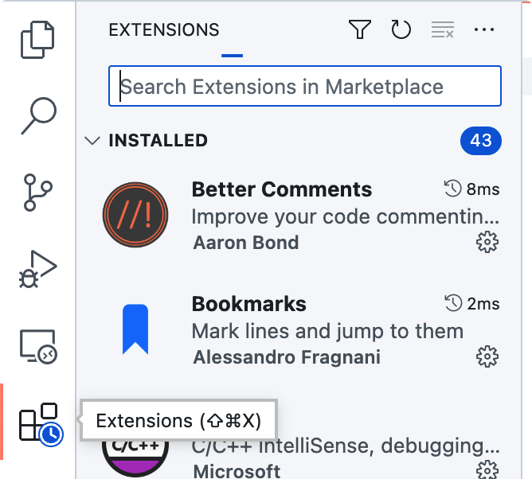

# Configure LaTeX in VSCode

English | [中文](README.zh.md)

This guide shows how to set up a LaTeX environment in VSCode for editing and previewing, so you can work efficiently and comfortably.

Supported features:

-   Auto compile on save
-   XeLaTeX and PdfLaTeX support (Chinese and English)
-   Output to a dedicated folder `./tmp`
-   English word completion with Chinese translations
-   LaTeX syntax completion
-   Fast math snippets (e.g. `@a` expands to `\alpha`)
-   Path auto-completion
-   Auto-generate matrix and figure environments
-   Live preview for equations and images
-   Auto-format `.tex` files

Example result after a full setup:


The configuration includes:

- [Software installation](#software-installation)
  - [Install TeX Live](#install-tex-live)
  - [Install VSCode](#install-vscode)
- [VSCode extensions](#vscode-extensions)
  - [How to install](#how-to-install)
  - [Recommended extensions](#recommended-extensions)
- [LaTeX Workshop configuration](#latex-workshop-configuration)
  - [Basic settings](#basic-settings)
  - [Compile toolchain](#compile-toolchain)
- [Advanced configuration](#advanced-configuration)
  - [Format LaTeX with latexindent](#format-latex-with-latexindent)
  - [Fast math input with HyperSnips for Math](#fast-math-input-with-hypersnips-for-math)
  - [Version control with Git](#version-control-with-git)
  - [Speed up with TikZ externalize](#speed-up-with-tikz-externalize)

## Software installation

### Install TeX Live

TeX Live is a full LaTeX distribution and is recommended for compiling LaTeX documents. If you previously installed MikTeX, uninstall it completely before installing TeX Live.

Windows / Linux users can download the installer here: [texlive.iso](https://mirrors.tuna.tsinghua.edu.cn/CTAN/systems/texlive/Images/). Download the ISO and run the installer.

Mac users can download: [MacTeX.pkg](https://mirrors.tuna.tsinghua.edu.cn/ctan/systems/mac/mactex/). Download the pkg and run it.

### Install VSCode

VSCode is a lightweight editor that supports LaTeX. Download the installer from [Visual Studio Code](https://code.visualstudio.com/download) and install it.

## VSCode extensions

### How to install

Click the Extensions icon on the left:



Search for the extension and click Install.

### Recommended extensions

Everything below is optional except LaTeX Workshop.

-   LaTeX Workshop

    LaTeX Workshop provides compilation, preview, and syntax checking.

    

-   English Word Hint

    English Word Hint suggests English words and shows Chinese translations to improve English writing efficiency.

    

-   Path Auto Complete

    Path Auto Complete inserts image paths quickly.

    

-   indent rainbow

    indent rainbow colorizes indentation levels.

    

-   Word Count CJK

    Word Count CJK counts words for Chinese documents.

    

-   Code Spell Checker

    Code Spell Checker checks English spelling with low memory overhead.

    

-   LTex

    LTex checks spelling and grammar, but is slower and uses more memory. Choose either LTex or Code Spell Checker.

    

-   Project Manager

    Project Manager helps you switch between multiple VSCode projects.

    

-   Material Icon Theme

    Material Icon Theme adds icons to the VSCode file tree.

    

-   WakaTime

    WakaTime tracks coding time by language for better time planning.

    

## LaTeX Workshop configuration

The settings below are my personal configuration. Adjust as needed.

### Basic settings

```json
"latex-workshop.hover.preview.mathjax.extensions": [
    "boldsymbol"
],
"latex-workshop.intellisense.package.enabled": true,
"latex-workshop.latex.outDir": "./tmp",
"latex-workshop.latex.recipe.default": "lastUsed",
"latex-workshop.mathpreviewpanel.cursor.enabled": true,
"latex-workshop.message.error.show": false,
"latex-workshop.message.warning.show": false,
"latex-workshop.view.pdf.invert": 1,
"latex-workshop.view.pdf.invertMode.enabled": "auto",
```

Click the gear icon in the lower-left corner of VSCode, choose Settings, and search for each option to update it. For example:


If you are comfortable with VSCode, open Command Palette, search for settings, open settings.json, and paste the snippet directly.

Explanation of each setting:

```text
// Enable boldsymbol in hover preview
"latex-workshop.hover.preview.mathjax.extensions": [
    "boldsymbol"
],
// Enable IntelliSense for package commands and environments
"latex-workshop.intellisense.package.enabled": true,
// Output directory for compiled files
"latex-workshop.latex.outDir": "./tmp",
// Default recipe uses the last one you ran
"latex-workshop.latex.recipe.default": "lastUsed",
// Enable the math preview panel for complex formulas
"latex-workshop.mathpreviewpanel.cursor.enabled": true,
// Disable error popups
"latex-workshop.message.error.show": false,
// Disable warning popups
"latex-workshop.message.warning.show": false,
// Invert colors when previewing PDF
"latex-workshop.view.pdf.invert": 1,
// Auto detect when to invert PDF colors
"latex-workshop.view.pdf.invertMode.enabled": "auto",
```

### Compile toolchain

I recommend using latexmk, which automatically detects changes and supports multiple engines such as XeLaTeX and PdfLaTeX.

In settings.json, find `latex-workshop.latex.tools` and `latex-workshop.latex.recipes`, delete them, and replace with:

```json
"latex-workshop.latex.recipes": [
    {
        "name": "XeLaTeX",
        "tools": [
            "xelatexmk"
        ]
    },
    {
        "name": "PdfLaTeX",
        "tools": [
            "pdflatexmk"
        ]
    }
],
"latex-workshop.latex.tools": [
    {
        "args": [
            "-synctex=1",
            "-pdfxe",
            "-interaction=nonstopmode",
            "-file-line-error",
            "-outdir=%OUTDIR%",
            "%DOC%"
        ],
        "command": "latexmk",
        "env": {},
        "name": "xelatexmk"
    },
    {
        "args": [
            "-synctex=1",
            "-pdf",
            "-interaction=nonstopmode",
            "-file-line-error",
            "-outdir=%OUTDIR%",
            "%DOC%"
        ],
        "command": "latexmk",
        "env": {},
        "name": "pdflatexmk"
    }
],
```

## Advanced configuration

This section is optional.

### Format LaTeX with latexindent

Install latexindent.pl first, following [latexindent.pl](https://github.com/cmhughes/latexindent.pl).

Add this to settings.json:

```json
"latex-workshop.latexindent.args": [
    "-g",
    "./%OUTDIR%/indent.log",
    "%TMPFILE%",
    "-y=defaultIndent: '%INDENT%'"
],
```

This sends latexindent.pl logs to `tmp/indent.log` for easier management.

### Fast math input with HyperSnips for Math

Install HyperSnips for Math and follow the extension's setup instructions.

With this extension, typing `eq` expands to:

```latex
\begin{equation}

\end{equation}
```

[latex.hsnips](latex.hsnips) is my personal config and supports two features.

Type `bmat n m` and press Space to generate an empty matrix:

```latex
// bmat 3 4
\begin{bmatrix}
     &  &  &  \\
     &  &  &  \\
     &  &  &  \\
\end{bmatrix}
```

Type `fig label n` and press Space to generate a figure block with multiple subfigures:

```latex
\begin{figure}[htb!]
    \centering
    \begin{subfigure}{.3\textwidth}
        \centering
        \includegraphics[width=\textwidth]{./img}
        \caption{}
        \label{fig:example_1}
    \end{subfigure}
    \begin{subfigure}{.3\textwidth}
        \centering
        \includegraphics[width=\textwidth]{./img}
        \caption{}
        \label{fig:example_2}
    \end{subfigure}
    \begin{subfigure}{.3\textwidth}
        \centering
        \includegraphics[width=\textwidth]{./img}
        \caption{}
        \label{fig:example_3}
    \end{subfigure}
    \caption{}
    \label{fig:example}
\end{figure}
```

Adjust other snippets as needed.

### Version control with Git

Install Git first. Click the Source Control icon in VSCode. If Git is missing, VSCode will prompt you to install it.


Recommended extensions:

-   GitLens

    GitLens adds blame and history features. Some features require a Pro subscription, so turn them off in settings. You can also use the free alternatives below.

-   Git Graph

    Git Graph shows the commit history visually.

-   Commit Message Editor

    Commit Message Editor formats commit messages. You can import this [config](shinyypig_commit_config.json).


### Speed up with TikZ externalize

Make sure your output directory is `./tmp/`, then add this to your `.tex` file:

```latex
\usetikzlibrary{external}
\immediate\write18{mkdir -p tmp/tmp/}
\tikzexternalize[
    prefix=tmp/,
    mode=list and make,
]
```

Then create a `latexmkrc` file at the project root:

```perl
$clean_ext .= ' %R.figlist %R-figure* %R.makefile fls.tmp';
$latex    = 'internal tikzlatex latex    %B %O %S';
$pdflatex = 'internal tikzlatex pdflatex %B %O %S';
$lualatex = 'internal tikzlatex lualatex %B %O %S';
$xelatex  = 'internal tikzlatex xelatex  %B %O %S';
$hash_calc_ignore_pattern{'pdf'} = '^(/CreationDate|/ModDate|/ID)';
$hash_calc_ignore_pattern{'ps'} = '^%%CreationDate';

sub tikzlatex {
  my ($engine, $base, @args) = @_;
  my $ret = 0;
  print "Tikzlatex: ===Running '$engine @args'...\n";
  $ret = system( $engine, @args );
  print "Tikzlatex: Fixing .fls file ...\n";
  system "echo INPUT \"$aux_dir1$base.figlist\"  >  \"$aux_dir1$base.fls.tmp\"";
  system "echo INPUT \"$aux_dir1$base.makefile\" >> \"$aux_dir1$base.fls.tmp\"";
  system "cat \"$aux_dir1$base.fls\"    >> \"$aux_dir1$base.fls.tmp\"";
  rename "$aux_dir1$base.fls.tmp", "$aux_dir1$base.fls";
  if ($ret) { return $ret; }
  if ( -e "$aux_dir1$base.makefile" ) {
    if ($engine eq 'xelatex') {
      print "Tikzlatex: ---Correcting '$aux_dir1$base.makefile' made under xelatex\n";
      system( 'perl', '-i', '-p', '-e', 's/^\^\^I/\t/', "$aux_dir1$base.makefile" );
    }
    elsif ($engine eq 'latex') {
      print "Tikzlatex: ---Correcting '$aux_dir1$base.makefile' made under latex\n";
      system( 'perl', '-i', '-p', '-e', 's/\.epsi/\.ps/', "$aux_dir1$base.makefile" );
    }
    print "Tikzlatex: ---Running 'make -f $aux_dir1$base.makefile' ...\n";
    if ($aux_dir) {
    #   system "perl -i -p -e 's#-shell-escape#-shell-escape -output-directory=\"$aux_dir1\"#g' $aux_dir1$base.makefile";
      system "perl -i -p -e 's#$base.figlist#$aux_dir1$base.figlist#g' $aux_dir1$base.makefile";
      system "cp $aux_dir1$aux_dir1*.md5 $aux_dir1";
      system "rm -rf $aux_dir1$aux_dir1";
      $ret = system "make",  "-j", "10", "-f", "$aux_dir1$base.makefile";
      system "rm $base.run.xml";
    }
    else {
      $ret = system "make",  "-j", "10", "-f", "$base.makefile";
    }
    if ($ret) {
      print "Tikzlatex: !!!!!!!!!!!!!! Error from make !!!!!!!!! \n",
            "  The log files for making the figures '$aux_dir1$base-figure*.log'\n",
            "  may have information\n";
    }
  }
  else {
    print "Tikzlatex: No '$aux_dir1$base.makefile', so I won't run make.\n";
  }
  return $ret;
}
```

Finally, update LaTeX Workshop tools as follows:

```json
"latex-workshop.latex.tools": [
    {
        "args": [
            "-synctex=1",
            "--pdfxe",
            "-shell-escape",
            "-interaction=nonstopmode",
            "-file-line-error",
            "-outdir=%OUTDIR%",
            "%DOC%"
        ],
        "command": "latexmk",
        "env": {},
        "name": "xelatexmk"
    },
    {
        "args": [
            "-synctex=1",
            "-pdflatex",
            "-shell-escape",
            "-interaction=nonstopmode",
            "-file-line-error",
            "-outdir=%OUTDIR%",
            "%DOC%"
        ],
        "command": "latexmk",
        "env": {},
        "name": "pdflatexmk"
    }
],
```
